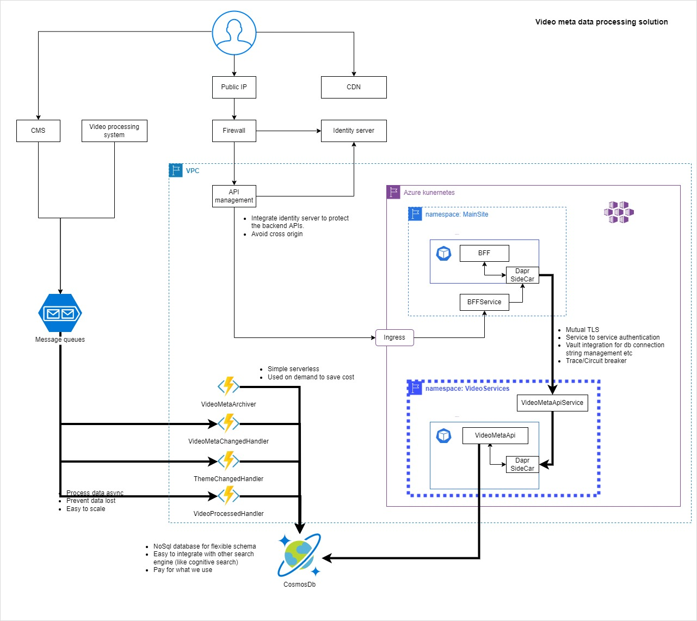

# VideoServices

This is a demo solution project.

Problem need to solve:

1. Persist video metadata from message queue into NoSQL database.
2. Archive video metadata which is marked as deleted for a specific time in NoSQL database. Like 60 days.
3. Provide APIs to search for the video metadata. 

## Solution design

- Resilience for service failure (like cascading failures)
- Zero trust between services
- Serve for long running
- Auto scale for large volume of data
- Auto scale for large volume of requests

    Above image file is exported from **drawio** app, the raw file is **/Design/VideoServices.drawio**.
    The focus will be the diagram drawn with bold line.

