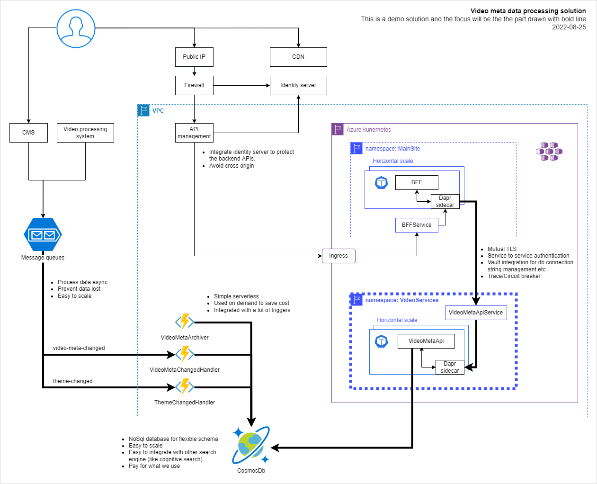

# Video meta processing solution for demo

This is a demo solution project.

Problem need to solve:

1. Persist video metadata from message queue into NoSQL database.
2. Archive video metadata which is marked as deleted for a specific time in NoSQL database. Like 60 days.
3. Provide APIs to search for themes or video metadata. 

## Solution design

- Resilience for service failure
- Zero trust between services
- Serving for long running
- Auto scale for large volume of data
- Auto scale for large volume of requests

    Above image file is exported from **drawio** app, the raw file is **/Design/VideoMeta.drawio**.
    The focus will be the diagram drawn with bold line.

## Local development

- Ensure Visual Studio 2022 is installed. (asp.net core, Azure product).
- Ensure Azure Cosmos DB Emulator is installed.
- Run: & 'C:\Program Files\Microsoft Visual Studio\2022\Community\Common7\IDE\Extensions\Microsoft\Azure Storage Emulator\azurite.exe'
- Run: Azure Cosmos DB Emulator
- Open Microsoft Azure Storage Explorer: to create or check queues (theme-changed, video-meta-changed)
- Open Azure Cosmos DB Emulator website: to check documents
- Run: VideoMeta.Api from Visual Studio
- Run: VideoMeta.Functions from Visual Studio
